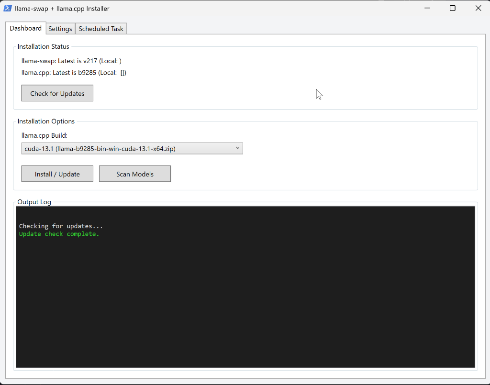

# ⚡ llama.cpp + llama-swap Installer / Updater



A native PowerShell WPF GUI application that downloads, installs, and configures [llama.cpp](https://github.com/ggml-org/llama.cpp) and [llama-swap](https://github.com/mostlygeek/llama-swap) on Windows — and keeps them up to date through an easy-to-use graphical dashboard.

---

## ✨ What it does

**Interactive run** — launches a native graphical dashboard (WPF) with no external dependencies that lets you:

- 📦 Download the latest **llama.cpp** and **llama-swap** Windows binaries from GitHub Releases
- 🔧 Choose a llama.cpp build from a drop-down menu (AVX2, AVX, Vulkan, CUDA, ...) — if an NVIDIA GPU is detected, the best matching CUDA build is pre-selected automatically
- 🔍 Scan a folder of your choice for `.gguf` model files
- 📝 Configure `config.yaml` for llama-swap with default model parameters inside the Settings tab
- 🔗 Generate an `opencode.json` so [opencode](https://opencode.ai) connects to llama-swap automatically
- 🚀 Create a `start-llama-swap.bat` launcher

**Background / Scheduled runs** — automatically bypasses the GUI when executed with `-NonInteractive`, silently updating the binaries only. Safe to schedule as a background task.

**CLI fallback** — use `--reconfigure` or `--scan` flags from the terminal to bypass the GUI and run the legacy text-based wizard.

---

## 🖥️ Requirements

- Windows 10 / 11
- PowerShell 5.1 or later (included with Windows)
- Internet connection (for downloading binaries from GitHub)
- `.gguf` model files (if you want to configure llama-swap)

> For CUDA builds of llama.cpp: an NVIDIA GPU with up-to-date drivers is required. The necessary CUDA runtime DLLs are downloaded automatically alongside the build — no separate CUDA Toolkit installation needed. The installer detects your GPU via `nvidia-smi` and pre-selects the highest CUDA build supported by your driver.

---

## 🚀 Quick Install

Run this in a PowerShell window:

```powershell
irm https://raw.githubusercontent.com/janvitos/llama-cpp-swap-installer-updater-ps/main/get.ps1 | iex
```

You will be prompted for an install directory (default: `%USERPROFILE%\llama-installer`). The installer downloads to that folder and launches immediately.

---

## 🔧 Manual Install

1. Download `install.ps1` and `install.bat` from this repo.
2. Place both files in the same folder.
3. Double-click `install.bat` to launch the GUI dashboard — or run in PowerShell:
   ```powershell
   .\install.ps1
   ```

---

## 🔄 Updating

Launch the GUI and click **Check for Updates**, or let the scheduled task handle it. In non-interactive mode, the script checks for new releases of llama.cpp and llama-swap and downloads them if available, then exits silently.

---

## ⚙️ Reconfiguring

To redo the full setup wizard via the classic CLI wizard (change model directory, rebuild `config.yaml`, etc.):

```bat
install.bat --reconfigure
```

Or in PowerShell:

```powershell
.\install.ps1 -Reconfigure
```

---

## 🔍 Rescanning Models

When you add or remove `.gguf` files, you can click **Scan Models** in the GUI, or regenerate `config.yaml` and `opencode.json` via the CLI:

```bat
install.bat --scan
```

Or in PowerShell:

```powershell
.\install.ps1 -Scan
```

---

## 🕐 Automatic Updates

At the end of the setup wizard, you will be offered the option to create a **Windows Task Scheduler** task that runs the updater silently in the background — once daily (at 03:00) and at every login. No administrator rights are required.

To remove the task later, open **Task Scheduler** and delete the task named `llama-cpp-swap-updater`, or run:

```powershell
Unregister-ScheduledTask -TaskName 'llama-cpp-swap-updater' -Confirm:$false
```

---

## 💾 Saved Settings

All your choices (install directory, model folder, listen host/port, and all model parameters) are saved to `settings.json` in the install directory. Subsequent runs will instantly load these values back into the GUI.

---

## 📁 Directory Layout

After a full install, your chosen directory will look like this:

```
<install dir>\
    install.ps1
    install.bat
    settings.json               <- saved settings (auto-generated)
    start-llama-swap.bat        <- double-click to start llama-swap
    llama.cpp\
        llama-server.exe
        (+ other llama.cpp binaries and DLLs)
        .version
    llama-swap\
        llama-swap.exe
        config.yaml
        .version
```

`config.yaml` and `opencode.json` are generated during the wizard and can be updated by running with `--reconfigure`.

---

## 🤖 llama-swap config.yaml

The GUI Settings tab lets you easily configure default settings for all your discovered `.gguf` models, including:

- Context window size
- GPU offloading (`--gpu-layers 999`)
- Sampling parameters (temperature, top_p, top_k, min_p, repeat penalty, presence penalty)

You can apply these parameters universally across all models with the click of a button.

---

## 🔗 opencode.json

If you use [opencode](https://opencode.ai), the wizard writes an `opencode.json` to `%USERPROFILE%\.config\opencode\opencode.json` that registers llama-swap as an OpenAI-compatible provider, with each model's context and output limits pre-filled.

---

## 📄 License

[MIT](LICENSE)
